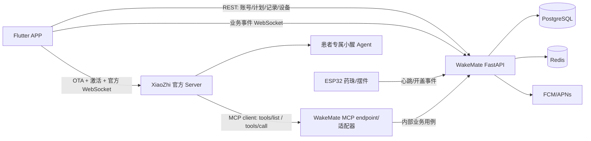

# WakeMate 应用与小智集成技术文档

> 版本：2026-09-26  
> 状态：目标架构与 APP 开发基线  
> 适用范围：WakeMate Flutter APP、WakeMate FastAPI、醒伴硬件、小智官方 Agent/MCP

## 1. 文档目标

这份文档回答四个开发问题：

1. Flutter APP 的页面和业务数据应该连接哪个服务。
2. APP 如何作为小智终端连接小智官方 Server。
3. 小智 Agent 如何通过 MCP 读取和写入 WakeMate 数据。
4. 当前交付包哪些代码可以复用，哪些代码必须替换或补齐。

本文把“目标架构”和“当前实现”分开描述。当前项目中的 Mock、项目自定义 WebSocket 和 `---MCP_CALL---` 文本协议不能直接视为官方小智协议或标准 MCP 实现。

后端独立部署、多租户、数据权限隔离和 APP API 具体规范见：[WakeMate 后端开发规范](wakemate-backend-development-spec.md)。

## 1.1 现状、目标和状态标记

| 标记 | 含义 |
|---|---|
| **当前可复用** | 交付包里已经存在、可以作为实现起点的代码或接口 |
| **迁移期** | 可以暂时保留，但不能当作官方协议或生产安全边界 |
| **目标/待实现** | 本文规定的最终接口，开发时需要补齐并验收 |

当前交付包是一个 MVP 原型：Flutter 对话页调用 WakeMate 的 `POST /v1/chat/completions` SSE，后端 `xiaozhi_client.py` 使用项目自定义的 `CHAT/STREAM_CHUNK/STREAM_END` 消息，`mcp_executor.py` 解析 `---MCP_CALL---` 文本；这些路径都属于**迁移期**。官方小智 OTA、激活、终端 WebSocket 和标准 MCP endpoint 尚未在本项目中完成联调。

开发顺序是：先用官方 Android 客户端验证小智账号、Agent 和 MCP 配置，再把协议实现接入 Flutter；在官方链路验收前，不要删除迁移期聊天接口，也不要把 Mock 返回当作真实成功。

## 2. 最终架构决策

### 2.1 服务职责

| 部分 | 负责内容 | 数据权威性 |
|---|---|---|
| Flutter APP | 页面、用户输入、音频采集/播放、协议连接、状态展示、本地通知 | 不保存业务真相 |
| 小智官方 Server/Agent | 对话编排、语音 ASR/TTS、意图识别、长期记忆、MCP 工具选择 | 只负责对话上下文和偏好记忆 |
| WakeMate FastAPI | 用户、用药计划、服药记录、设备、推送、统计、权限和审计 | **业务数据唯一来源** |
| WakeMate MCP endpoint/适配器 | 对外暴露 WakeMate 业务工具，供小智 Server 的 MCP client 调用 | 不直接绕过业务层 |
| PostgreSQL | 用户和业务数据持久化 | 业务数据主库 |
| Redis | 缓存、漏服计时、短期队列、限流 | 非主数据 |
| ESP32 药珠/摆件 | 本地 RTC、开合检测、状态上报、硬件执行 | 不保存云端业务真相 |

### 2.2 目标拓扑



图中的 MCP endpoint 由 WakeMate 暴露，小智官方 Server/Agent 作为 MCP client 发起 `tools/list` 和 `tools/call`。APP 不连接 MCP；WakeMate 也不需要反向连接一个“小智 MCP endpoint”。控制台或自部署小智 Server 只保存该 endpoint 的服务端地址和凭证。

### 2.3 对话和业务的两条通道

```text
文字/语音对话：
Flutter APP → 小智 OTA/激活 → 小智官方 WebSocket → 小醒 Agent
                                              ↓
                                      WakeMate MCP 工具

页面业务操作：
Flutter APP → WakeMate REST/WebSocket → WakeMate 业务服务 → 数据库/设备/推送
```

例如：

- 用户在聊天框说“我刚吃了药”：小智 Agent 判断意图，调用 `record_dose`，WakeMate 校验并写入服药记录。
- 用户点击页面上的“已服用”：APP 直接调用 `POST /api/records/confirm`，不经过 Agent。
- 用户说“我今天吃药了吗”：Agent 调用 `get_today_dose_status`，WakeMate 查询数据库后返回结果。
- 用户修改剂量：首版由 APP 页面调用 WakeMate API，并要求业务确认；Agent 不能直接修改医嘱数据。

## 3. 患者、Agent 和设备身份

### 3.1 身份对象

系统至少要维护以下逻辑关系：

| 标识 | 产生方 | 用途 |
|---|---|---|
| `wakemate_user_id` | WakeMate 登录 | WakeMate 数据权限和主键 |
| `xiaozhi_agent_id` | 小智控制台 | 患者专属角色、模型、记忆配置 |
| `xiaozhi_device_id` | OTA/设备客户端 | 小智连接和记忆隔离上下文 |
| `xiaozhi_client_id` | APP 本地生成并持久化 | WebSocket 客户端身份 |
| `mcp_binding_id` | WakeMate | Agent 与 WakeMate MCP 凭证的绑定 |

建议在 WakeMate 增加一张逻辑绑定表（名称可按现有 ORM/迁移规范调整）：

```text
xiaozhi_bindings
  id
  wakemate_user_id
  xiaozhi_agent_id
  xiaozhi_device_id
  xiaozhi_client_id
  mcp_binding_id
  status
  created_at
  updated_at
```

### 3.2 一人一个 Agent

首版采用“一位患者一个小醒 Agent”：

- 每位患者的角色提示词、声音和长期记忆相互隔离。
- APP 和患者的语音硬件都绑定到这个患者的 Agent。
- 不需要为每位患者部署一套模型或一台 Server。
- 运营上先人工在小智控制台创建/绑定，后续再评估是否接入自部署控制台 API 自动化。

小智开源 Server 的记忆实现会使用设备身份作为记忆隔离键；官方托管服务的跨设备记忆行为需要用测试账号验证。因此：

- 长期记忆可保存称呼、沟通偏好和非关键背景。
- 用药计划、剂量、服药结果、漏服判定必须实时从 WakeMate 查询。
- 不能把小智记忆当作医疗业务数据库。

多用户上线前还必须验证小智 Server 是否把稳定的 Agent/设备身份传递给 MCP endpoint。如果 MCP 调用上下文只有一个共享 token、没有可验证的 Agent 标识，则不能让同一个 endpoint 直接服务所有患者；应按 Agent 使用独立 endpoint 凭证，或在 WakeMate 前增加能验证 Agent 身份的网关。无论采用哪种方式，MCP 都不能接受模型自行传入的 `user_id`。

## 4. APP 端技术分层

### 4.1 推荐目录

在现有 `flutter_app/lib` 下增加以下模块：

```text
lib/
├─ core/
│  ├─ api/
│  │  ├─ rest_client.dart                 # 已有：WakeMate REST
│  │  ├─ ws_client.dart                   # 已有：WakeMate 业务事件 WS
│  │  └─ wakemate_realtime_ticket.dart    # 待补：获取短期 WS ticket
│  ├─ xiaozhi/
│  │  ├─ xiaozhi_ota_service.dart         # 待补：OTA 配置
│  │  ├─ xiaozhi_activation_service.dart  # 待补：激活/轮询
│  │  ├─ xiaozhi_realtime_client.dart     # 待补：官方 WS
│  │  ├─ xiaozhi_session.dart              # 待补：session_id 和状态机
│  │  └─ xiaozhi_audio_codec.dart          # 待补：Opus 编解码
│  └─ storage/
│     └─ secure_token_store.dart           # 待补：安全保存 token/设备身份
├─ data/
│  ├─ repositories/
│  │  ├─ wakemate_repository.dart          # 待补：业务数据
│  │  └─ xiaozhi_chat_repository.dart      # 待补：文字/语音对话
│  └─ models/
└─ features/
   └─ chat/chat_page.dart                  # 已有：只依赖 repository
```

### 4.2 APP 不直接调用 MCP

APP 只需要：

- 调用 WakeMate REST/WebSocket；
- 连接小智官方的终端 WebSocket；
- 展示 Agent 返回的文字、语音和工具执行后的结果。

APP 不保存 MCP endpoint token，也不直接执行 `tools/call`。MCP 凭证只放在服务端适配器中。

### 4.3 对现有代码的调整

| 现有文件 | 当前状态 | 目标调整 |
|---|---|---|
| `lib/core/api/rest_client.dart` | WakeMate REST 客户端，接口基本可复用 | 去除生产环境静默 Mock，统一错误模型 |
| `lib/core/api/ws_client.dart` | 预期连接 `/ws/session/{user_id}`，但后端暂无对应路由 | 改为短期 ticket 鉴权，并补后端路由 |
| `lib/core/api/openai_client.dart` | 调用 WakeMate `/v1/chat/completions` | 作为迁移期备用通道；小智直连完成后由 repository 切换 |
| `lib/features/chat/chat_page.dart` | 直接依赖 `XiaoxingChatClient` | 改依赖 `ChatRepository`，支持 `xiaozhi_direct`/备用模式 |
| `backend/services/xiaozhi_client.py` | 自定义 `CHAT/STREAM_CHUNK/STREAM_END` 协议 | 不要直接当作官方协议；移除或明确标为 legacy adapter |
| `backend/services/mcp_executor.py` | 解析 `---MCP_CALL---` 文本并执行 SQL/推送 | 重构为业务用例；新增标准 MCP 适配器 |

## 5. 小智官方连接协议

APP 参考 `xiaozhi-android-client` 的 Kotlin 实现，但最终在 Flutter 中用 Dart 重写。不能把 Android 项目直接嵌入 Flutter，也不能只复制一个 WebSocket URL。

### 5.0 版本边界

下面的字段是当前官方客户端的**实现基线**，不是跨版本永久不变的 schema。实际开发必须以正在使用的小智 Server 的 OTA 响应和 `xiaozhi-android-client` 对应提交为准；未知字段要保留，协议错误要原样记录为可诊断错误，不能自动改成 Mock 成功。

### 5.1 连接流程

```text
启动 APP
  ↓
读取/生成 xiaozhi_device_id 和 xiaozhi_client_id
  ↓
调用小智 OTA 接口
  ↓
若返回 activation：显示激活码并等待激活完成
  ↓
取得 websocket.url、token、protocol version
  ↓
使用官方请求头建立 WebSocket
  ↓
发送 hello，等待服务端 hello 和 session_id
  ↓
进入 Ready
```

### 5.2 WebSocket 请求头

至少按官方客户端流程处理：

```text
Authorization: Bearer <xiaozhi_token>
Protocol-Version: <hello.version>
Device-Id: <xiaozhi_device_id>
Client-Id: <xiaozhi_client_id>
```

`xiaozhi_token` 和 WakeMate JWT 是两种不同的凭证：

- WakeMate JWT：访问 WakeMate 业务 API。
- 小智 token：访问小智 Agent WebSocket。

两者都不能写死在代码中，也不能写入日志。

### 5.3 Hello 消息

```json
{
  "type": "hello",
  "version": 1,
  "features": {"mcp": true},
  "transport": "websocket",
  "audio_params": {
    "format": "opus",
    "sample_rate": 16000,
    "channels": 1,
    "frame_duration": 60
  }
}
```

APP 必须读取服务端返回的 `audio_params`，不要永久假设采样率和帧长。

### 5.4 文字消息

官方客户端的文字输入使用带 `session_id` 的 `listen/detect` 消息：

```json
{
  "type": "listen",
  "state": "detect",
  "text": "我今天吃药了吗？",
  "session_id": "server-issued-session-id"
}
```

APP 需要处理的服务端文本事件至少包括：

```text
hello       握手和 session_id
stt         语音识别文本
tts         Agent 回复文本和播放状态
mcp         MCP 相关消息（通常由终端协议承载）
alert       连接/激活/业务告警
```

语音输入时，APP 发送 Opus 二进制帧；收到服务端音频帧后解码播放。文字对话先行通过后，再接入录音和播放，减少首轮排障范围。

### 5.5 连接状态机

```text
Uninitialized
  → OtaLoading
  → ActivationRequired
  → Activating
  → Connecting
  → Handshaking
  → Ready
  → Listening / Speaking
  → Disconnected / Error
```

状态规则：

- `ActivationRequired` 必须显示可操作的激活提示，不能显示“网络错误”。
- `Handshaking` 超时要可重试，并区分 401/403、协议不匹配、网络超时。
- `Ready` 之前禁止发送 `listen`。
- 服务端返回新的 `session_id` 后，旧 session 的消息不得继续发送。
- 生产模式不允许网络错误后静默切换到本地 Mock。

## 6. WakeMate REST API 契约

所有需要用户权限的 APP 请求使用：

```text
Authorization: Bearer <wakemate_access_token>
```

### 6.1 已有接口

| 方法 | 路径 | 用途 |
|---|---|---|
| POST | `/api/auth/otp` | 请求短信验证码 |
| POST | `/api/auth/login` | 手机号登录，返回 WakeMate JWT |
| POST | `/api/auth/fcm-token` | 上报 FCM token |
| GET | `/api/plans` | 获取用药计划 |
| POST | `/api/plans` | 创建用药计划 |
| PUT | `/api/plans/{plan_id}` | 更新用药计划 |
| DELETE | `/api/plans/{plan_id}` | 软删除用药计划 |
| POST | `/api/records/confirm` | 确认服药并归档 |
| GET | `/api/records?days=7` | 获取服药记录 |
| GET | `/api/records/stats?days=30` | 获取统计 |
| GET | `/api/device` | 获取设备和状态 |
| POST | `/api/device/register` | 注册 WakeMate 设备 |
| GET | `/api/settings` | 获取用户设置 |
| PUT | `/api/settings` | 更新提醒和推送设置 |
| PUT | `/api/settings/profile` | 更新昵称和时区 |
| GET/POST | `/api/shop/...` | 商城和订单，按页面需要接入 |
| GET | `/health` | 服务健康检查 |

### 6.2 设备上报接口

当前固件使用：

```text
POST /api/device/{device_sn}/heartbeat
POST /api/device/{device_sn}/event
```

生产环境必须给设备接口增加设备级认证或签名。不能只依赖公开的 `device_sn`，也不能让 ESP32 使用患者 JWT。

建议后续增加：

```text
X-Device-Id: <device-id>
X-Device-Timestamp: <unix-ms>
X-Device-Nonce: <nonce>
X-Device-Signature: HMAC-SHA256(...)
```

### 6.3 业务 WebSocket

当前 `ws_client.dart` 预期 `/ws/session/{user_id}`，但当前 FastAPI 路由中尚未实现该端点。生产契约建议使用短期 ticket：

```text
POST /api/realtime/ticket
  → {"ticket": "short-lived-ticket", "expires_in": 60}

WSS /ws/session?ticket=<ticket>
```

服务端消息统一采用：

```json
{
  "event_id": "evt_01...",
  "type": "DOSE_MISSED",
  "occurred_at": "2026-09-26T10:00:00Z",
  "payload": {}
}
```

APP 至少处理：

```text
REMINDER_TRIGGER
DOSE_CONFIRMED
DOSE_MISSED
DOSE_SNOOZED
DEVICE_STATUS
BATTERY_LOW
PLAN_SYNC_DOWN
```

事件必须可去重。APP 以 `event_id` 记录已处理事件，重复事件不能重复弹窗或重复归档。

## 7. MCP 工具契约

### 7.1 连接方式

WakeMate MCP 适配器是一个**标准 MCP server/endpoint**：它对外提供工具列表和 `tools/call`，内部调用 WakeMate 的 `PlanService`、`DoseService`、`DeviceService` 和 `NotificationService`。小智官方 Server/Agent 内置 MCP client，连接这个 endpoint 并根据 Agent 意图调用工具。

```text
小智官方 Server/Agent（MCP client）
  → tools/list、tools/call
  → WakeMate MCP endpoint（MCP server）
  → WakeMate Application Service
  → PostgreSQL / Redis / 推送 / 设备
```

使用官方全模块/控制台部署时，按官方文档把 WakeMate endpoint 的健康检查地址配置到控制台；使用单模块部署时，把 endpoint 的 WebSocket 地址配置到小智 Server 的 `mcp_endpoint`。地址格式和认证参数以当前 Server 版本为准。APP 不连接这个 endpoint，也不保存 endpoint token。

### 7.2 工具分级

#### 只读工具：首轮开放

| 工具 | 作用 |
|---|---|
| `get_today_medication_plan` | 查询今日计划和下一次服药时间 |
| `get_today_dose_status` | 查询今天每次服药状态 |
| `get_device_status` | 查询药珠在线、电量、余量和最后心跳 |
| `get_adherence_stats` | 查询按时率、漏服数和连续天数 |
| `get_user_preferences` | 查询称呼、时区和提醒偏好 |

#### 受控写工具：通过验证后开放

| 工具 | 默认策略 |
|---|---|
| `record_dose` | 只接受明确的“已服用/刚吃了”等确认；必须幂等 |
| `snooze_reminder` | 校验剩余次数和允许的延迟范围 |
| `vibrate_device` | 只能使用预置震动模式和频率限制 |
| `notify_caregiver` | 必须经过静默时段、日上限和严重级别策略 |
| `update_user_preference` | 只允许非医疗偏好，如称呼和提醒语气 |

首版不开放：

- 修改药物剂量；
- 修改、删除或停用用药计划；
- 删除服药记录；
- 修改家属关系和权限；
- 任意高优先级推送。

### 7.3 工具身份和参数

工具参数不能让模型自行决定患者身份：

```json
{
  "plan_id": "plan_123",
  "scheduled_time": "2026-09-26T08:00:00+08:00",
  "actual_time": "2026-09-26T08:05:00+08:00",
  "idempotency_key": "xiaozhi-session-xxx-turn-yyy"
}
```

`user_id` 应由 MCP binding、Agent、设备或服务端凭证推导和校验，不能信任模型传入的 `user_id`。

工具返回统一结构：

```json
{
  "success": true,
  "data": {},
  "error_code": null,
  "message": ""
}
```

写工具必须记录审计信息：

```text
audit_id
wakemate_user_id
source = app | xiaozhi_agent | device | worker
tool_name
idempotency_key
request_summary
result
created_at
```

### 7.4 业务层复用

APP、MCP 和硬件事件不能各自写 SQL。目标调用链是：

```text
REST Router ─┐
MCP Adapter ─┼→ Application Service ─→ Repository ─→ Database
Device Event ┘
```

当前 `services/mcp_executor.py` 直接执行 `dose_records` SQL，可作为原型，但生产前应迁移到共享的 `DoseService`、`PlanService`、`DeviceService` 和 `NotificationService`。

## 8. 用药业务规则

这些规则由 WakeMate 后端执行，不能交给 Agent 自由决定：

1. 开盖事件是辅助信号，不等于服药确认。
2. 正式服药确认来自用户点击或明确的 Agent 工具调用。
3. 漏服由后端计时器判定，不由模型计算。
4. 剂量调整、停药和换药必须遵医嘱，Agent 不能给出执行性医疗指令。
5. 家属推送必须经过静默时段和日上限检查。
6. 重复的 `record_dose` 必须返回原记录，不得重复插入。
7. 所有时间在 API 中使用带时区的 ISO 8601；数据库统一 UTC，展示按用户时区转换。

## 9. Flutter 页面开发指导

### 9.1 登录和启动

1. APP 启动读取 WakeMate JWT 和小智客户端身份。
2. JWT 失效时清理业务会话并回到登录页。
3. 小智 token 失效时只显示小智连接状态，不影响用药计划页面。
4. 两套服务的错误状态分别显示，不能统一显示“网络异常”。

### 9.2 首页

首页数据来自 WakeMate：

- 下一次服药时间；
- 今日按时率；
- 当前漏服状态；
- 设备电量和在线状态；
- 未读提醒。

首页不从小智长期记忆推导业务状态。

### 9.3 对话页

对话页应依赖抽象接口：

```dart
abstract interface class ChatRepository {
  Stream<ChatEvent> sendText(String text);
  Future<void> startVoice();
  Future<void> stopVoice();
  Future<void> abort();
  Stream<ChatConnectionState> get connectionState;
}
```

实现：

- `XiaozhiChatRepository`：正式小智 OTA/激活/WebSocket/音频实现。
- `WakeMateLegacyChatRepository`：迁移期调用 `/v1/chat/completions`。

页面不应直接引用 `Dio`、`WebSocketChannel` 或小智 JSON 协议。

### 9.4 计划页和记录页

- 计划页使用 WakeMate REST CRUD。
- 保存成功后显示 `synced_to_hw` 状态。
- 同步失败要允许重试，不能显示为已同步。
- 记录页以 WakeMate 返回结果为准，MCP 写入后通过事件或刷新同步。

### 9.5 设备页

- 展示设备注册状态、最后心跳、电量、药珠余量。
- “模拟开盖”只保留在开发构建或 Mock 模式。
- 生产 APP 不直接伪造硬件事件。

## 10. 部署方案

### 10.1 首版最简部署

```text
同一台服务器（开发/MVP）：
  wakemate-api       FastAPI REST + 迁移期聊天 + 后台 worker
  wakemate-mcp       同一代码仓库中的 MCP endpoint（可单独进程）
  postgres           业务主库
  redis              缓存和漏服队列

外部/独立：
  小智官方 Server 或 xiaozhi.me 托管服务
  FCM/APNs
```

最简实现不需要 Dify、OpenClaw 或 Hermes：代码放在同一个 WakeMate 仓库，开发时可以部署在同一台服务器；MCP endpoint 建议使用独立进程或容器，避免长连接阻塞 REST 请求，但它与 API 共用同一业务服务层和数据库。小智官方 Server 是否自部署，不影响 APP 的业务 API 设计。

### 10.2 不放入关键链路的组件

首版不需要 Dify、OpenClaw 或 Hermes。它们可以作为后续知识库或通用自动化实验组件，但不放入患者用药记录、漏服判定和家属告警链路。

### 10.3 小智服务的部署选择

| 阶段 | 建议 | 原因 |
|---|---|---|
| P0 协议验证 | 使用小智官方托管/控制台 | 最快验证 OTA、激活、Agent、记忆和 MCP 调用，不增加运维变量 |
| P1 内测 | 继续托管，WakeMate 自己部署 API 和 MCP endpoint | APP、业务数据和工具权限已经由 WakeMate 控制 |
| 生产或私有化 | 按数据合规、音频链路和运维能力决定是否自部署小智 Server | 自部署增加 ASR/TTS、模型、队列、升级和监控维护成本 |

两种部署都使用同一套 APP 分层和 WakeMate API。不要为了“自部署”把小智 Server、WakeMate API、MCP endpoint 和数据库合并成一个进程。

### 10.4 密钥边界

| 密钥 | 保存位置 |
|---|---|
| WakeMate JWT | APP 安全存储，短期有效 |
| 小智 token | APP 安全存储，按设备/Agent 管理 |
| MCP endpoint token | 仅 WakeMate MCP 适配器服务端 |
| 数据库密码、FCM 凭证 | 服务端环境变量或密钥管理系统 |
| 设备 HMAC 密钥 | 设备安全存储和服务端密钥存储 |

## 11. 分阶段开发和验收

### P0：协议可行性验证

- 用 Android 参考客户端或自写最小 Flutter 客户端完成 OTA、激活和 WebSocket 握手。
- 在小智控制台绑定一个测试 Agent 和一个测试设备身份。
- 发送一条 `listen/detect` 文字消息并收到 Agent 回复。
- 记录 401、403、激活失败、协议版本不匹配和超时的真实错误。

验收：不用 WakeMate 业务功能，能稳定完成 20 次文字对话。

### P1：接入现有 Flutter 对话页

- 新增 `XiaozhiChatRepository`。
- ChatPage 改为依赖 repository。
- 先支持文字，再支持断线重连、打断和错误状态。
- `/v1/chat/completions` 保留为迁移期备用模式。

验收：APP 页面不再直接依赖旧的 `XiaoxingChatClient`，可通过配置切换正式/备用通道。

### P2：WakeMate 业务链路

- 完成 JWT、计划、记录、设备和设置页面的真实 API 接入。
- 补业务 WebSocket ticket 和事件路由。
- 补设备级心跳/事件签名。
- 移除生产路径中的静默 Mock 降级。

验收：断网、401、服务器 500、重复事件、计划同步失败都有可见状态和可重试动作。

### P3：MCP 只读工具

- 为一个测试 Agent 配置 MCP endpoint。
- 注册 `get_today_medication_plan`、`get_today_dose_status`、`get_device_status`。
- 验证 MCP adapter 的 Agent/用户绑定和日志。

验收：Agent 只能读取绑定患者数据，不能读取其他患者。

### P4：MCP 受控写入

- 先开放 `record_dose`，实现幂等、审计、事务和权限校验。
- 再开放 `snooze_reminder`、`vibrate_device`。
- 最后按推送策略开放 `notify_caregiver`。

验收：同一口令重复发送不会产生重复服药记录；Agent 不能修改剂量或删除历史记录。

### P5：语音和硬件

- 接入 Opus 录音/播放。
- 验证 APP 文字、APP 语音、ESP32 事件三条链路使用同一患者绑定。
- 验证小智记忆跨设备行为，不通过测试则以 WakeMate 业务数据为准。

## 12. 当前交付包的已知缺口

以下项目在正式联调前必须处理：

1. `backend/services/xiaozhi_client.py` 使用的是项目自定义 `CHAT/STREAM_CHUNK/STREAM_END`，不是官方小智设备协议。
2. `flutter_app/lib/core/api/openai_client.dart` 当前连接 WakeMate `/v1/chat/completions`，尚未接入官方 OTA/激活/`listen` 协议。
3. `flutter_app/lib/core/api/ws_client.dart` 预期的后端业务 WebSocket 路由当前未在 FastAPI 中实现。
4. `backend/services/mcp_executor.py` 是文本标记解析器和内部执行器，不是标准 MCP endpoint 适配器。
5. 设备心跳和事件接口当前需要补设备级认证和重放保护。
6. 多处 Flutter/后端代码在异常时返回 Mock 或默认数据，生产模式必须改为显式错误状态。
7. `HANDOFF.md` 引用的 `db-schema.sql` 当前不在交付包中；正式部署前必须补 Alembic migration 或可审计的 SQL schema，不能只依赖 `init_db()` 或文档中的占位路径。
8. ESP32 固件当前没有完整实现 `PLAN_SYNC_DOWN` 的接收和解析；计划保存成功不能直接显示为“已同步到硬件”。
9. 当前 FastAPI 没有实现 `ws_client.dart` 预期的 `/ws/session/{user_id}`；在补齐 ticket、事件去重和鉴权前，APP 应使用轮询/推送或明确的未连接状态。

## 13. 官方参考

- [xiaozhi-esp32-server](https://github.com/xinnan-tech/xiaozhi-esp32-server)
- [MCP 接入点使用指南](https://github.com/xinnan-tech/xiaozhi-esp32-server/blob/main/docs/mcp-endpoint-integration.md)
- [MCP 接入点启用指南](https://github.com/xinnan-tech/xiaozhi-esp32-server/blob/main/docs/mcp-endpoint-enable.md)
- [xiaozhi-android-client](https://github.com/luo785859020/xiaozhi-android-client)
- [xiaozhi-client-flutter](https://github.com/eiriksgata/xiaozhi-client-flutter)

参考项目只用于协议和客户端实现参考。上线前必须以你实际使用的小智服务版本、控制台配置和激活响应为准。
