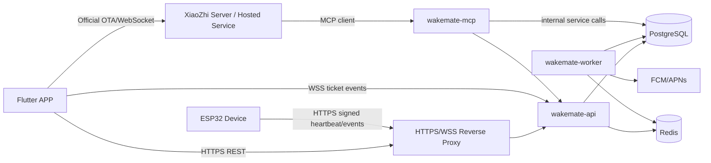

# WakeMate 后端开发规范

> 版本：v1.0  
> 更新日期：2026-09-26  
> 状态：后端实现基线  
> 适用范围：独立部署的 WakeMate 后端、Flutter APP、ESP32 设备、WakeMate MCP endpoint  
> 配套文档：[系统架构与 APP 开发基线](wakemate-app-system-architecture.md)

## 1. 文档目标

本文是 WakeMate 后端团队的实现规范。后端独立部署，Flutter APP 通过 HTTPS/WSS 访问，业务数据由 WakeMate 保存和授权；小智官方 Server 通过 MCP 调用 WakeMate 的业务工具，不能绕过 WakeMate 的权限和业务规则。

本文解决：

1. 多租户怎样建模，避免患者、家属、设备和 Agent 串数据。
2. APP 使用哪些稳定的 HTTP/WebSocket 契约，怎样兼容现有 Flutter 代码。
3. JWT、设备凭证、MCP 凭证各自负责什么，怎样禁止越权。
4. 数据库、事务、幂等、审计、错误和部署怎样落地。
5. 当前 MVP 代码哪些可以复用，哪些必须重构后才能进入生产。

### 1.1 规范用词

- **必须**：上线前必须满足；不满足时不能进入生产。
- **应该**：默认实现方式；采用其他方式时必须证明安全和兼容性等价。
- **可以**：可选增强，不影响基础契约。
- current：当前交付包已有路径，可能含 Mock 或安全缺口。
- target：本文要求的生产路径。

### 1.2 当前实现与目标边界

当前交付包是 MVP 原型，不能把现状当作生产实现：

| 模块 | 当前实现 | 目标要求 |
|---|---|---|
| APP 业务 API | Flutter rest_client.dart 调用 /api/* | 保留主要路径和字段，增加统一错误、租户上下文和幂等语义 |
| APP 实时事件 | Flutter 预期 /ws/session/{user_id}，FastAPI 当前没有该路由 | 使用短期 ticket 的 WSS，用户身份从 ticket/JWT 推导 |
| 对话 | /v1/chat/completions + 自定义 CHAT/STREAM_CHUNK/STREAM_END | 作为迁移期兼容接口；正式对话按小智官方 OTA/WebSocket 接入 |
| MCP | ---MCP_CALL--- 文本解析和 raw SQL | 独立标准 MCP endpoint，调用共享 Application Service |
| 数据库 | 路由中直接写 SQL，开发环境 create_all | Alembic 迁移、Repository、事务、租户约束和 RLS |
| 设备 | device_sn 可直接上报，缺少设备签名 | 设备凭证/HMAC、时间戳、nonce、重放保护 |
| Mock | 多处网络失败返回默认数据或 Mock 成功 | 生产关闭静默降级，错误必须可见、可重试、可审计 |

## 2. 目标架构与部署边界

### 2.1 服务职责

| 组件 | 负责内容 | 不负责的内容 |
|---|---|---|
| wakemate-api | APP REST API、认证、授权、计划、记录、设备管理、设置、实时 ticket、健康检查 | 不把 MCP secret 下发给 APP；不把模型输出当作授权 |
| wakemate-worker | 漏服判定、计划同步、推送、Outbox 消费和重试 | 不直接接受公网用户请求 |
| wakemate-mcp | 对小智 Server 暴露 tools/list 和 tools/call，建立 Agent/租户/患者绑定 | 不直接写 SQL；不允许模型传入任意 user_id |
| PostgreSQL | 业务主数据、租户边界、审计和幂等记录 | 不作为缓存或消息队列 |
| Redis | 短期缓存、限流、OTP、重连状态和任务辅助状态 | 不作为服药记录唯一来源 |
| ESP32 | 本地提醒、RTC、事件上报和执行硬件命令 | 不决定用户权限，不保存云端业务真相 |
| Flutter APP | 页面、输入输出、本地展示、官方小智会话和业务 API 调用 | 不执行 MCP，不携带数据库或设备主密钥 |

### 2.2 推荐部署拓扑



开发或小规模内测可以把 API、worker 和 MCP 放在同一台服务器、同一代码仓库中；生产仍应使用独立进程或容器。不能为每个租户部署一套数据库或一套后端，租户隔离由数据模型、授权策略和数据库策略共同完成。

### 2.3 两条独立数据路径

```text
APP 页面：
Flutter → WakeMate HTTPS/WSS → Application Service → PostgreSQL/Redis/设备/推送

APP 对话：
Flutter → 小智 OTA/激活/官方 WebSocket → 小醒 Agent
                                      ↓ MCP tools/call
                           WakeMate MCP endpoint → Application Service
```

APP 不直接连接 MCP endpoint。小智 Agent 的长期记忆只保存称呼、偏好和对话背景；用药计划、剂量、服药结果、漏服判定和设备状态必须实时读取 WakeMate。

## 3. 多租户模型

### 3.1 租户定义

tenant 是业务数据的第一层隔离边界。个人用户注册时创建个人租户；机构、养老院或家庭组织可以创建组织租户。一个用户可以属于多个租户，但每个 access token 只代表一个 active tenant context。

必须遵守：

1. 所有租户拥有的表必须有不可为空的 tenant_id。
2. 任何业务查询必须同时携带 tenant_id 和资源关系条件，不能只按 user_id 或资源 ID 查询。
3. tenant_id 由已验证的 JWT、设备凭证或 MCP binding 得到，不能从普通请求 body 信任。
4. 用户切换租户时重新签发包含新租户上下文的 token。
5. 跨租户平台运维使用独立服务身份，默认不能读取患者明细；每次 break-glass 都审计。

### 3.2 核心身份关系

```text
Tenant
 ├─ Membership ─ User
 ├─ PatientAccessGrant ─ Caregiver → Patient(User)
 ├─ Device → Patient(User)
 ├─ AgentBinding → Patient(User) ↔ XiaoZhi Agent/Profile/Device
 └─ Business data: plans / reminders / dose_records / settings / audit_logs
```

不要把 users.role 作为唯一权限来源。它可以保留用于兼容当前代码，但实际授权必须来自 tenant_memberships 和 patient_access_grants。

### 3.3 推荐数据表

字段名可按 ORM 约定调整，但关系和约束不能省略。

| 表 | 必需字段 | 关键约束 |
|---|---|---|
| tenants | id, name, kind, status, timezone, created_at | status 只能是 active/suspended/deleted |
| users | id, phone, display_name, timezone, token_version, deleted_at | 手机号是全局唯一身份；软删除后不能直接复用旧身份 |
| tenant_memberships | tenant_id, user_id, role, status, created_at | (tenant_id, user_id) 唯一；角色来自白名单 |
| patient_access_grants | tenant_id, patient_id, caregiver_id, scopes, status | 同租户约束；撤销后立即失效 |
| user_settings | tenant_id, user_id, 推送/静默/稍后提醒字段 | (tenant_id, user_id) 唯一 |
| devices | tenant_id, patient_id, device_id, device_sn, status | device_sn 全局唯一；转移必须经过解绑流程 |
| device_credentials | tenant_id, device_id, key_id, secret_hash | secret 只存哈希或密钥管理引用，支持撤销和轮换 |
| medication_plans | tenant_id, patient_id, drug_name, dosage, times, active, sync_version | 所有读写带租户和患者条件 |
| reminders | tenant_id, patient_id, plan_id, reminder_id, scheduled_at, status | (tenant_id, reminder_id) 唯一 |
| dose_records | tenant_id, patient_id, plan_id, reminder_id, result, confirmed_by | (tenant_id, reminder_id) 幂等唯一 |
| agent_bindings | tenant_id, patient_id, agent_id, profile_id, client_id, credential_id | active binding 只能指向一个患者 |
| fcm_tokens | tenant_id, user_id, token_hash, platform, revoked_at | token 去重、撤销、最后使用时间 |
| realtime_tickets | tenant_id, user_id, jti, scope, expires_at, used_at | 一次性或短时有效 |
| idempotency_keys | tenant_id, actor_id, key, operation, request_hash, response | 同一主体重复请求返回同一结果 |
| audit_logs | tenant_id, actor_type, actor_id, patient_id, action, request_id | 追加写，不允许业务用户修改或删除 |
| outbox_events | tenant_id, event_id, event_type, aggregate_id, payload, status | 与业务写入同一事务 |
| public_access_tokens | token_hash, purpose, tenant_id, patient_id, expires_at | 随机、可撤销、只存 hash |

### 3.4 租户与患者关系

- 患者可以属于多个租户，但每条计划、记录和设备属于一个明确租户。
- 家属必须有有效的 patient_access_grants，不能因为知道患者 ID 就访问。
- tenant_admin 默认管理成员、设备绑定和配置，不自动获得所有患者医疗明细。
- patient 默认只能访问自己的数据。
- caregiver 只能访问被授予的患者和 scope，例如 plans:read、records:read、reminders:write。
- 一个设备只能绑定一个 active patient；转移设备必须有显式解绑、重新认领和审计记录。
- 一个小醒 Agent/Profile 绑定一个患者；Agent 记忆隔离和 WakeMate 业务数据隔离必须同时存在。

## 4. 身份认证与授权

### 4.1 JWT access token

当前 APP 兼容的登录响应必须保留：

```json
{
  "access_token": "<opaque-jwt>",
  "token_type": "bearer",
  "user_id": "user_01...",
  "role": "patient",
  "expires_in": 3600
}
```

生产建议增加 refresh_token、tenant_id 和 permissions，但不能删除上述字段：

```json
{
  "access_token": "<jwt>",
  "refresh_token": "<rotating-token>",
  "token_type": "bearer",
  "user_id": "user_01...",
  "tenant_id": "tenant_01...",
  "role": "patient",
  "permissions": ["plan:read", "dose:write"],
  "expires_in": 3600
}
```

JWT 至少包含 iss、aud、sub、tenant_id、membership_id、role、token_version、jti、iat 和 exp。

规范：

1. sub、tenant_id 和 membership 必须由服务端签发，APP 不能修改。
2. 所有业务路由从 token 构造 RequestContext，不得读取 body 的 user_id、tenant_id 或 role 授权。
3. token_version 用于全局撤销；退出所有设备、改绑设备或安全事件时递增。
4. access token 建议 15 至 60 分钟；refresh token 轮换并存哈希。
5. 不在日志、异常、SSE、MCP 返回和设备响应中打印完整 token。

### 4.2 OTP 登录

保留现有 APP 路径：

```text
POST /api/auth/otp
POST /api/auth/login
POST /api/auth/fcm-token
```

生产约束：

- OTP 只保存哈希，过期不超过 5 分钟，成功后立即失效。
- 按手机号、IP、设备指纹和租户维度限流；连续失败触发冷却。
- 固定 123456 只能在 development profile 启用，不能由请求参数切换。
- 生产 /api/auth/otp 不返回验证码；短信失败必须返回明确错误。
- 登录成功时创建或选择 active tenant，并写入登录审计。

### 4.3 RequestContext

每个请求进入应用层后必须有：

```python
RequestContext(
    request_id="req_...",
    actor_type="user | caregiver | agent | device | worker | admin",
    actor_id="...",
    tenant_id="...",
    patient_id="...",
    membership_id="...",
    scopes={"plan:read", "dose:write"},
)
```

patient_id 对患者本人可由 sub 得到；对家属必须通过 grant 解析；对 Agent 必须通过 agent_bindings 解析；对设备必须通过 device_credentials 解析。调用方不能自行填充该字段。

## 5. 权限模型

### 5.1 权限矩阵

| 操作 | patient | caregiver | tenant_admin | agent | device |
|---|---:|---:|---:|---:|---:|
| 读取自己的资料/设置 | 允许 | 允许自己的 | 允许管理成员摘要 | 禁止 | 禁止 |
| 读取绑定患者计划 | 自己 | plans:read | 默认禁止明细 | 绑定患者 | 禁止 |
| 新建/修改剂量计划 | 页面确认后允许自己 | 默认禁止 | 默认禁止 | 禁止 | 禁止 |
| 读取服药记录 | 自己 | records:read | 默认只读聚合 | 绑定患者 | 禁止 |
| 确认服药 | 自己 | dose:write | 默认禁止 | 仅受控工具 | 只能上报事件 |
| 稍后提醒 | 自己 | reminder:write | 按政策 | snooze_reminder | 禁止 |
| 控制硬件 | 自己绑定设备 | device:control | 按设备管理权 | 预置工具 | 自己执行命令 |
| 修改家属关系 | 授权流程 | 授权流程 | 允许管理成员 | 禁止 | 禁止 |
| 跨租户访问 | 禁止 | 禁止 | 禁止 | 禁止 | 禁止 |

平台运维 support 不属于普通租户角色。排障使用带原因、工单号、过期时间的临时授权，并记录审计。

### 5.2 授权检查顺序

1. 校验 TLS、请求格式和 access token。
2. 校验 token 的 iss、aud、exp、token_version。
3. 构造 RequestContext，确定 tenant_id 和 actor。
4. 校验 actor 的 membership/status。
5. 解析患者关系或资源归属，禁止信任 body/path 中的归属字段。
6. 校验 action scope 和资源状态。
7. 执行带 tenant_id、patient_id、资源 ID 的查询或更新。
8. 写入审计和必要的 outbox 事件。

资源不存在和无权访问默认都返回 404，避免泄露其他租户资源是否存在；授权失败返回 403 时不得包含资源敏感信息。

### 5.3 SQL 约束

业务查询必须类似：

```sql
SELECT id, drug_name, dosage, times, active
FROM medication_plans
WHERE tenant_id = :tenant_id
  AND patient_id = :patient_id
  AND id = :plan_id
  AND deleted_at IS NULL;
```

禁止只按资源 ID 查询：

```sql
SELECT * FROM medication_plans WHERE id = :plan_id;
```

所有更新和删除也必须把 tenant_id、资源归属和状态条件放进 WHERE。

### 5.4 PostgreSQL RLS

生产 PostgreSQL 应对患者数据表启用 RLS，作为应用授权之外的第二层防线。每个事务开始时使用事务级上下文：

```sql
SELECT set_config('app.tenant_id', :tenant_id, true);
SELECT set_config('app.actor_id', :actor_id, true);
SELECT set_config('app.patient_id', :patient_id, true);
```

连接池归还连接前必须使用事务级 SET LOCAL，不能把上一个请求的租户变量留在连接上。RLS 未完成前，不得宣称已完成多租户隔离。

## 6. APP API 契约

### 6.1 通用 HTTP 约定

- Base URL 由 APP 配置，例如 https://api.example.com；APP 不暴露数据库、Redis 或 MCP 地址。
- 业务路径保持当前 /api/*，破坏性变更使用 /api/v2/*。
- 鉴权：Authorization: Bearer <wakemate_access_token>。
- 客户端可发送 X-Request-Id；服务端必须生成并在响应头返回。
- 确认服药、设备事件、订单和高影响命令使用 Idempotency-Key。
- JSON 使用 application/json；时间使用带时区的 ISO 8601。
- 数据库和事件内部使用 UTC；计划展示、静默时间和统计按 users.timezone 计算。
- APP 不发送 user_id、tenant_id 作为权限字段；如为兼容旧请求携带，服务端必须忽略或拒绝不一致值。

错误响应统一为：

```json
{
  "error": {
    "code": "PLAN_NOT_FOUND",
    "message": "用药计划不存在",
    "request_id": "req_01...",
    "details": {}
  }
}
```

错误码至少包括：AUTH_REQUIRED、TOKEN_EXPIRED、FORBIDDEN、RESOURCE_NOT_FOUND、VALIDATION_ERROR、CONFLICT、IDEMPOTENCY_REPLAY、RATE_LIMITED、DEVICE_UNAUTHORIZED、UPSTREAM_UNAVAILABLE、INTERNAL_ERROR。

### 6.2 Flutter 需要兼容的接口

| 方法 | 路径 | APP 用途 | 生产要求 |
|---|---|---|---|
| POST | /api/auth/otp | 请求验证码 | 限流、哈希、无生产回显 |
| POST | /api/auth/login | 登录，返回 JWT | 创建/选择租户上下文 |
| POST | /api/auth/fcm-token | 上报推送 token | token 归属当前用户和租户 |
| GET/POST | /api/plans | 查询/创建计划 | 只访问当前患者；写入产生同步任务 |
| PUT/DELETE | /api/plans/{plan_id} | 更新/软删除计划 | 患者授权、版本冲突、审计 |
| POST | /api/records/confirm | 点击确认服药 | 幂等、事务、不可伪造患者 |
| GET | /api/records?days=7 | 服药记录 | 天数限制、患者关系、UTC 转换 |
| GET | /api/records/stats?days=30 | 统计图 | 使用用户时区，不能硬编码时区 |
| GET | /api/device | 设备列表和状态 | 只返回当前患者绑定设备 |
| POST | /api/device/register | APP 认领设备 | 绑定码/设备凭证，不信任 SN 所有权 |
| GET/PUT | /api/settings | 推送和提醒设置 | 设置属于当前 tenant + user |
| PUT | /api/settings/profile | 修改昵称/时区 | 校验 IANA timezone |
| GET | /api/settings/caregiver | 家属关系摘要 | 只返回授权关系 |
| GET | /api/shop/skus | 商品列表 | 可公开缓存，不携带患者数据 |
| POST/GET | /api/shop/orders | 订单 | 订单按 tenant + actor 隔离 |
| GET | /badge/{token} | 胸牌轮询 | 随机公开 token、最小字段、限流 |
| GET | /emergency/{token} | 急救页 | token hash、可撤销、最小敏感信息 |

### 6.3 计划接口

请求保持 Flutter 当前字段：

```json
{
  "drug_name": "示例药物",
  "dosage": "1片",
  "times": ["08:00", "20:00"],
  "note": "饭后",
  "color": "#2C4A7E"
}
```

后端必须：

- 校验 times 是合法 HH:MM，去重、排序，并按患者 timezone 生成提醒。
- 写入 medication_plans、sync_version 和 outbox 事件必须在一个事务中完成。
- synced_to_hw=true 只能在设备确认对应 sync_version 后返回；任务刚创建时必须是 false 或 pending。
- 修改计划使用乐观版本字段，避免 APP 和家属页面互相覆盖；冲突返回 409。
- 删除只能软删除，历史服药记录不得被删除。

响应兼容当前 PlanOut，并可增加 sync_status、sync_version：

```json
{
  "id": "plan_01...",
  "drug_name": "示例药物",
  "dosage": "1片",
  "times": ["08:00", "20:00"],
  "note": "饭后",
  "color": "#2C4A7E",
  "active": true,
  "synced_to_hw": false,
  "sync_status": "pending",
  "sync_version": 12,
  "created_at": "2026-09-26T00:00:00Z"
}
```

### 6.4 服药记录接口

请求保持当前 APP 字段，但 user_id、tenant_id 和 actual_time 的最终归属由后端处理：

```json
{
  "reminder_id": "reminder_01...",
  "plan_id": "plan_01...",
  "drug_name": "示例药物",
  "scheduled_time": "2026-09-26T08:00:00+08:00",
  "confirmed_by": "user_tap"
}
```

规则：

1. plan_id 必须属于当前 tenant 和 patient，drug_name 不能覆盖数据库中的药物名称。
2. reminder_id 是幂等键；重复确认返回第一次记录，不得插入第二条。
3. confirmed_by=user_tap 只能由 APP 用户会话使用；agent_inference 只能由 MCP binding 使用；caregiver 需要对应 grant。
4. actual_time 由服务端生成，除非是受控设备事件并有可信设备时间。
5. result、delay_seconds 由后端基于计划和时间计算，不能由 APP 或模型自由传入。
6. 记录写入、取消漏服任务、审计和 outbox 事件必须可恢复；推送失败不能回滚已确认记录。

### 6.5 统计接口

GET /api/records/stats?days=30 返回当前 Flutter 可消费的数组，但日期必须使用患者 timezone 计算：

```json
[
  {
    "date": "2026-09-26",
    "total": 2,
    "ontime": 2,
    "late": 0,
    "missed": 0,
    "rate": 100.0,
    "streak_days": 3
  }
]
```

统计查询必须有 tenant_id、patient_id 和日期范围条件；不能使用当前代码中的固定 Asia/Shanghai。

### 6.6 设备 API

APP 的设备管理和设备本体上报必须分开：

```text
APP/JWT:
POST /api/device/register
GET  /api/device

设备凭证/HMAC:
POST /api/device/{device_id}/heartbeat
POST /api/device/{device_id}/event
```

APP 注册只创建绑定意图或消费一次性 claim code，不能仅凭用户提交的 device_sn 把任意设备归到自己名下。设备上报不使用患者 JWT，不把 device_sn 当作秘密。

### 6.7 实时事件 API

目标流程：

```text
POST /api/realtime/ticket
  Authorization: Bearer <JWT>
  → {"ticket":"...","expires_in":60,"protocol":"wakemate-events.v1"}

WSS /ws/session?ticket=<short-lived-ticket>
```

ticket 只包含当前用户、active tenant、允许的 patient scope 和 jti，建议 60 秒有效，首次连接后立即标记使用。服务端绝不使用 URL 中的 user_id 作为授权依据。

事件统一格式：

```json
{
  "event_id": "evt_01...",
  "tenant_id": "tenant_01...",
  "type": "DOSE_CONFIRMED",
  "occurred_at": "2026-09-26T00:05:00Z",
  "sequence": 42,
  "payload": {
    "patient_id": "patient_01...",
    "reminder_id": "reminder_01..."
  }
}
```

APP 需要按 event_id 去重，并在断线后使用 sequence 或 REST 刷新补偿。当前 ws_client.dart 的 REGISTER、PING 和 /ws/session/{user_id} 只能视为迁移期协议。

### 6.8 迁移期聊天接口

保留 POST /v1/chat/completions 供当前 Flutter 迁移使用：

- Bearer JWT 是唯一用户身份来源。
- 请求 body 的 user 字段不能决定目标用户；不一致时返回 400/403。
- session_type 只能是允许的枚举。
- 上游小智连接失败时返回明确的 UPSTREAM_UNAVAILABLE，生产不能自动返回本地 Mock。
- mcp_results 只能是审计后的结构化结果，不能放入内部密钥、SQL 或其他租户数据。

正式 APP 对话按总架构文档连接小智官方 OTA/WebSocket；WakeMate 后端仍负责业务 REST、MCP 工具和权限边界。

## 7. 设备安全与计划同步

### 7.1 设备凭证

设备首次绑定使用一次性 claim code 或物理配对流程，完成后签发设备级凭证。服务端保存 secret_hash 或密钥管理系统引用，设备端只保存无法从日志恢复的密钥。

每次心跳/事件至少携带：

```text
X-Device-Id: <device-id>
X-Device-Key-Id: <key-id>
X-Device-Timestamp: <unix-ms>
X-Device-Nonce: <random-nonce>
X-Device-Signature: HMAC-SHA256(method + path + timestamp + nonce + body)
```

服务端必须校验 TLS、设备状态、时间窗口、nonce 未使用、签名和设备租户/患者绑定。nonce、timestamp 和 body hash 需要进入重放防护记录。

### 7.2 设备事件

设备事件包括 BEAD_OPEN、REMINDER_TRIGGER、BATTERY_LOW、PLAN_SYNC_ACK 等。开盖事件是辅助信号，不能直接写成服药确认；服药确认仍来自用户点击、明确 Agent 工具调用或受控 caregiver 操作。

### 7.3 计划同步

计划写入后：

1. 业务事务写入新的 sync_version 和 outbox_events。
2. worker 向绑定设备发送计划快照。
3. 设备验证版本并返回 PLAN_SYNC_ACK。
4. 服务端只在收到对应设备确认后，把计划标记为 synced。
5. 失败、过期或设备离线时状态为 pending/failed，APP 显示重试，不显示成功。

当前 ESP32 固件尚未完整实现 PLAN_SYNC_DOWN 接收闭环，后端不得在“发送成功”时提前将 synced_to_hw 标为 true。

## 8. MCP endpoint 规范

### 8.1 调用方向

WakeMate 暴露 MCP server/endpoint，小智官方 Server 是 MCP client：

```text
小智 Server → tools/list / tools/call → WakeMate MCP endpoint
                                      → Application Service
                                      → PostgreSQL/设备/推送
```

APP 不连接 MCP，也不保存 MCP endpoint token。

### 8.2 MCP 身份映射

MCP 请求必须从 endpoint 凭证、连接 metadata 或可信的 Agent binding 推导：

```text
mcp_credential
  → agent_binding
  → tenant_id + patient_id + allowed_scopes
```

模型参数禁止包含或覆盖 user_id、tenant_id、patient_id、caregiver_user_id、role。如果小智 Server 不能传递可验证的 Agent 身份，则一个共享 endpoint 不能直接承载多患者写入；应使用每个 Agent 独立凭证，或在 WakeMate 前增加身份网关。

### 8.3 工具分级

首轮只开放只读工具：

```text
get_medication_plans
get_today_schedule
get_dose_records
get_adherence_stats
get_device_status
check_quiet_hours
```

验证身份、幂等和审计后再开放受控写工具：

```text
confirm_dose       # 只能确认当前绑定患者的一个 reminder
snooze_reminder    # 校验剩余次数和允许范围
vibrate_device     # 只能使用预置模式和频率限制
notify_caregiver   # 执行静默时段、权限和日上限策略
```

首版禁止 Agent 修改/删除药物计划、修改剂量、删除历史记录、修改家属关系和无限推送。高影响操作必须返回 pending_confirmation，由 APP、家属或医生确认。

### 8.4 工具返回与审计

```json
{
  "success": true,
  "code": "DOSE_RECORDED",
  "message": "服药记录已确认",
  "data": {"record_id": "record_01..."},
  "request_id": "req_01..."
}
```

每次工具调用必须记录 tenant_id、绑定 ID、Agent ID、patient ID、tool name、参数摘要、idempotency key、结果、request ID、操作者类型和时间。参数日志必须脱敏，不能记录 token、完整手机号或不必要的医疗内容。

MCP handler 只能调用 DoseService、PlanService、DeviceService 和 NotificationService，不能直接执行 SQL 或调用 router。

## 9. 后端代码结构

目标目录：

```text
backend/
├─ app/
│  ├─ main.py
│  ├─ api/v1/                 # 只做协议适配和依赖注入
│  ├─ api/dependencies.py     # auth、tenant、request context
│  ├─ domain/                 # 枚举、值对象、领域规则
│  ├─ application/            # PlanService、DoseService、DeviceService
│  ├─ repositories/           # 查询统一带 tenant 条件
│  ├─ infrastructure/         # DB、Redis、FCM、设备 adapter
│  ├─ mcp/                    # 标准 MCP endpoint 与 binding 校验
│  ├─ workers/                # outbox、漏服、同步、推送
│  └─ schemas/                # DTO，不暴露 ORM 对象
├─ migrations/                # Alembic 迁移
├─ tests/
│  ├─ unit/
│  ├─ integration/
│  ├─ contract/
│  └─ security/
└─ deploy/
   ├─ docker-compose.dev.yml
   └─ docker-compose.prod.yml
```

调用方向必须是：

```text
HTTP/MCP/Device adapter
  → authorization + application service
  → repository / external adapter
  → transaction + outbox
```

路由层禁止直接写业务 SQL、从 body 读取 user_id/tenant_id 授权、复用请求 session 创建后台任务、捕获所有异常后返回空数据或 Mock 成功。

当前 plans.py 把请求 AsyncSession 传给后台 create_task，必须改为 outbox/队列任务并在 worker 内创建新 session；当前 mcp_executor.py 的 raw SQL 只能作为迁移参考。

## 10. 数据库、事务和缓存

### 10.1 迁移

- 生产必须使用 Alembic 或等价的可审计迁移；禁止依赖 Base.metadata.create_all。
- 每次迁移必须可前进、可回滚或提供明确的数据修复脚本。
- 新增租户字段时先回填、再加非空约束；不能直接破坏性变更生产表。
- 当前交付包缺少 db-schema.sql 和迁移目录，这是 P0 阻塞项。

### 10.2 事务与幂等

- 计划写入、outbox 事件和审计记录在一个 DB 事务中。
- 服药确认以 (tenant_id, reminder_id) 唯一约束保证幂等；重复请求返回原记录。
- 推送、设备命令和外部调用不能持有 DB 事务等待；先写 outbox，再由 worker 发送。
- worker 至少一次执行，必须用业务幂等键抵抗重复消费。
- 乐观锁使用 version 或 updated_at 条件，冲突返回 409。

### 10.3 Redis key

所有 Redis key 必须包含租户和主体命名空间：

```text
wm:{env}:tenant:{tenant_id}:user:{user_id}:otp:{phone_hash}
wm:{env}:tenant:{tenant_id}:patient:{patient_id}:missed:{reminder_id}
wm:{env}:tenant:{tenant_id}:device:{device_id}:state
wm:{env}:tenant:{tenant_id}:rate:{actor_id}:{operation}
```

禁止使用只有 user_id、device_sn 或 reminder_id 的全局 key。缓存命中后仍需校验资源状态，缓存不可成为权限来源。

## 11. 安全、隐私与公开接口

### 11.1 网络和密钥

- 公网只暴露 HTTPS/WSS 入口，内部服务使用私网或 mTLS。
- 数据库、Redis、FCM、MCP、设备密钥只来自环境变量或密钥管理系统。
- APP 只保存短期 JWT、小智客户端凭证和设备身份；使用 Android Keystore/安全存储，不在普通 SharedPreferences 保存长期密钥。
- CORS 只允许明确的管理端来源；移动 APP 的 Bearer 请求不需要开放任意来源。
- 关闭生产 FastAPI docs 或使用管理员身份保护 /docs。

### 11.2 日志与审计

结构化日志至少包含 timestamp、level、service、request_id、tenant_id、actor_type、actor_id、route、status_code 和 latency_ms。手机号、token、药物细节和急救联系人必须脱敏。

业务审计和运行日志分开保存。审计记录追加写，保留谁在什么租户、以什么身份、对哪个患者的哪个资源做了什么操作，以及成功/失败原因。

### 11.3 badge 和急救公开页

/badge/{token} 和 /emergency/{token} 是公开接口，不得把可枚举的 user_id 当 token。必须使用至少 128 bit 随机值，数据库只存 hash，支持过期、撤销、轮换、限流和最小字段返回。不得返回完整病历、精确地址或不必要的联系人信息。

### 11.4 医疗业务红线

- Agent 不修改剂量、不诊断、不提供停药或换药指令。
- 开盖不等于服药确认。
- 漏服判定由后端规则和任务执行，不由模型计算。
- 家属通知经过静默时段、日上限和关系权限校验。
- 所有高影响写操作可追溯、可撤销或可人工复核。

## 12. 部署与运维规范

### 12.1 最小生产服务

```text
reverse-proxy      TLS、限流、请求 ID
wakemate-api       REST、认证、授权、ticket、健康检查
wakemate-worker    漏服、outbox、计划同步、推送重试
wakemate-mcp       MCP endpoint，独立凭证和连接池
postgres           主库，备份和 PITR
redis              缓存/队列辅助
```

MVP 可以同机部署这些容器；扩容时先独立 API、worker 和 MCP，再按数据库和队列负载扩展。小智官方 Server 是否托管，不改变 APP 与 WakeMate 的 API 契约。

### 12.2 环境变量

必须提供 .env.example，但只能放占位符：

```text
APP_ENV=development|staging|production
APP_SECRET_KEY=<secret-manager-reference>
DATABASE_URL=<postgres-url>
REDIS_URL=<redis-url>
JWT_ISSUER=wakemate-auth
JWT_AUDIENCE=wakemate-api
MCP_ENDPOINT_PUBLIC_URL=<https-or-wss-url>
FCM_CREDENTIALS_FILE=<secret-file-reference>
DEVICE_SIGNING_KEY_REF=<secret-manager-reference>
```

生产启动时检查必填配置、TLS、数据库迁移版本、Redis 连通性和 MCP binding 配置；配置缺失应启动失败，不能自动进入 Mock。

### 12.3 健康检查

- /health/live：进程存活，不检查外部依赖。
- /health/ready：数据库、Redis、迁移版本和关键队列可用。
- /metrics：只在内网或受保护入口开放。
- 健康响应不能泄露数据库 URL、token、租户数或异常堆栈。

关键指标：请求成功率、P95 延迟、401/403/404/409 比例、OTP 限流、服药确认幂等命中、漏服任务积压、计划同步失败、设备在线率、MCP tool error、推送失败率。

## 13. 测试与验收

### 13.1 多租户隔离测试

必须自动化覆盖：

1. 租户 A 的患者不能读取、更新或删除租户 B 的计划、记录、设备和设置。
2. 同一用户切换租户后，旧 token 不能访问新租户数据。
3. 家属只能访问被授予的患者和 scope；撤销 grant 后立即失效。
4. body 中的 tenant_id、patient_id 和 caregiver_user_id 不能扩大权限。
5. 资源 ID、缓存 key 和 reminder ID 碰撞不能造成跨租户数据返回。
6. 设备 A 伪造设备 B 的 SN、nonce 或签名必须失败，并产生安全日志。
7. Agent A 的 MCP 凭证不能调用患者 B 的工具；模型传入任意 user ID 必须被忽略或拒绝。
8. RLS 和连接池复用不能串租户上下文。

### 13.2 APP 合同测试

使用真实 OpenAPI schema 或 Pact 等价合同测试验证：

- 登录响应仍包含 Flutter 当前读取的 access_token、user_id、role、expires_in。
- 计划字段 drug_name、dosage、times、note、color、active、synced_to_hw 不破坏现有页面。
- 记录列表和统计仍返回数组，新增字段保持向后兼容。
- 401 清理 APP 会话；403、404、409、429 显示不同可操作状态。
- 网络失败不返回空设置、空商城或 Mock 服药成功。
- WSS 断线重连使用 ticket，事件按 event_id 去重。

### 13.3 业务验收场景

```text
创建计划 → 生成提醒 → 设备同步 pending → PLAN_SYNC_ACK → synced
提醒到点 → APP/Agent 确认 → 一条 dose_record → 取消漏服任务 → outbox 推送
重复确认 → 返回同一 dose_record，不新增记录
漏服超时 → worker 写 missed → 按策略通知家属 → 全链路有 audit
解绑设备 → 旧设备签名失败 → 新设备重新 claim → 计划重新同步
```

### 13.4 发布门禁

以下任一项未完成，禁止生产发布：

- 数据库迁移和回滚方案未审查。
- 跨租户、跨患者访问测试不通过。
- 生产仍开启静默 Mock 或固定 OTP。
- 设备接口没有签名和重放保护。
- record_dose 没有唯一约束和幂等测试。
- MCP 身份不能映射到唯一租户和患者。
- 计划同步在没有设备 ACK 时显示成功。
- 公开 token 可枚举或不可撤销。

## 14. 现有代码改造清单

| 现有位置 | 必须处理 |
|---|---|
| backend/core/security.py | 增加 iss、aud、jti、token_version、tenant_id 校验；token 轮换和撤销 |
| backend/routers/deps.py | 从 JWT 构造 RequestContext，增加 membership、grant 和 scope 检查 |
| backend/routers/*.py | 路由只做 DTO/依赖注入；业务迁移到 Application Service；SQL 带 tenant/patient 条件 |
| backend/routers/plans.py | 去掉请求 session 的后台 create_task；改 outbox + worker；等待设备 ACK 再标记同步 |
| backend/routers/records.py | 改为 DoseService；唯一约束保证 reminder 幂等；实际时间和结果由后端计算 |
| backend/routers/device.py | 分离 APP 管理和设备上报；增加 device credential/HMAC/nonce/replay 防护 |
| backend/services/mcp_executor.py | 移除生产 raw SQL 和 ---MCP_CALL--- 解析；改标准 MCP endpoint + 共享服务层 |
| backend/services/xiaozhi_client.py | 标记为迁移期 legacy adapter；连接失败不能静默 Mock |
| backend/main.py | 增加 live/ready、request ID、统一异常、worker 生命周期和优雅关闭 |
| flutter_app/lib/core/api/rest_client.dart | 生产关闭 Mock；使用安全存储；解析统一错误和 request ID |
| flutter_app/lib/core/api/ws_client.dart | 改 ticket 握手，移除 URL/body 的 user_id 注册；按 event_id 去重 |
| flutter_app/lib/core/api/openai_client.dart | 保留迁移期接口，但连接失败展示明确错误；正式对话切换 ChatRepository |

## 15. 实施顺序

### P0：租户与数据库基线

- 创建 Alembic 初始迁移和租户相关表。
- 为业务表补 tenant_id、patient_id、索引、外键和唯一约束。
- 实现 RequestContext、membership、patient grant 和审计模型。
- 禁止生产 create_all。

### P1：鉴权与 APP REST 兼容

- 保持现有 /api/* 路径和 Flutter 读取字段。
- JWT 增加 active tenant、token version、jti、issuer/audience。
- 统一错误、request ID、幂等 header、UTC 时间和用户 timezone。
- 给 Flutter 提供 staging API 地址和 OpenAPI schema。

### P2：业务服务与事务

- 把计划、记录、设备和推送逻辑迁移到 Application Service。
- 实现 dose 幂等、outbox、worker、新 session 任务。
- 修复统计时区、设置默认值静默降级和计划同步提前成功。

### P3：实时、设备和推送

- 实现 realtime ticket、WSS 事件协议和 event 去重。
- 完成设备 claim、HMAC、nonce、设备状态和计划 ACK。
- 验证断网、重连、重复事件和推送失败恢复。

### P4：MCP 与 Agent

- 部署独立 wakemate-mcp endpoint。
- 先开放只读工具，验证 binding 到唯一租户/患者。
- 再开放 confirm_dose、snooze_reminder 和 vibrate_device。
- 每个工具复用 Application Service，完成审计和越权测试。

### P5：生产加固

- 启用 RLS、密钥管理、备份/PITR、监控和告警。
- 关闭所有生产 Mock、固定 OTP 和默认空数据。
- 完成发布门禁、灾备恢复和隐私数据清理演练。

## 16. 交付物清单

后端达到可联调状态时，至少应交付：

```text
backend/
├─ .env.example
├─ openapi.json
├─ migrations/                 # 可审计迁移
├─ app/                        # API、domain、application、repository
├─ mcp/                        # MCP endpoint
├─ workers/                    # outbox、漏服、同步、推送
├─ tests/security/             # 跨租户、IDOR、设备和 MCP 隔离
├─ tests/contract/             # Flutter API 合同
├─ deploy/docker-compose.*.yml
└─ RUNBOOK.md                  # 部署、回滚、备份、告警处理
```

本规范与总架构文档一起使用：总架构回答 APP、小智、MCP、硬件的系统边界；本文规定 WakeMate 后端如何独立部署、隔离数据并提供稳定的 APP 契约。
